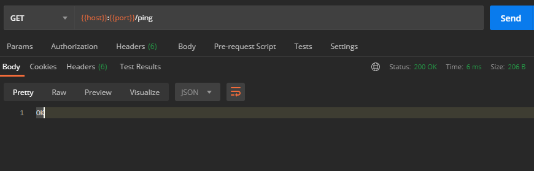
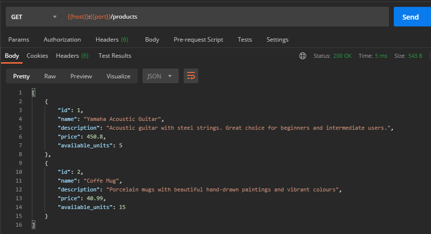
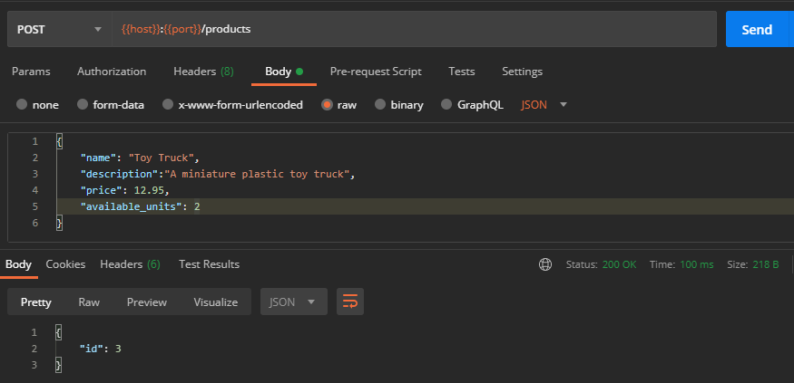

## Node-SQLite Demo Project

A simple and quick REST API implementation demo using Node.js with SQLite as the backing datastore.

---

### Project Setup:

1. clone this repo.
2. cd into the cloned project directory.
3. run `npm install`
4. run `mkdir .data`
5. run `touch .env`
6. run `echo PORT=3001 > .env`
7. run `npm start`

### Database Schema:

#### tbl_product

| Column Name     | Type    | Is Primary Key | Is Auto Incremented |
| --------------- | ------- | -------------- | ------------------- |
| id              | INTEGER | yes            | yes                 |
| name            | TEXT    | no             | no                  |
| description     | TEXT    | no             | no                  |
| price           | REAL    | no             | no                  |
| available_units | INTEGER | no             | no                  |

### Endpoints:

#### Gerneral

1. `GET /` - gives a 200 OK response.
2. `GET /ping` - same as `GET /`
   

#### products

1. `GET /products` - lists all products in DB as a JSON response.
   

2. `POST /products` - add a new product
   
